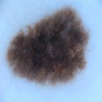

# Skin-Leison-Segmentation-Homework




## Install

```
pip install -r requirements.txt
```
* Python 3.9.5


## Results
|                                              | Train Loss | Test Loss |    Dice    | Volume Similarity | Average Surface Distance | Hausdorrf Distance |
| :------------------------------------------: | :--------: | :-------: | :--------: | :---------------: | :----------------------: | :----------------: |
|                Baseline Unet                 |   0.0945   |  0.1584   |   0.8929   |      0.9087       |          0.5142          |       12.23        |
|               DeeplabV3+resnet               |   0.1319   |  0.1786   |   0.8725   |      0.8878       |          0.5945          |       12.03        |
|                   HardMSEG                   |   0.0754   |  0.1935   |   0.8721   |      0.8958       |          0.5865          |       11.90        |
|                 Bigger Unet                  |   0.0980   |  0.1517   |   0.8987   |      0.9140       |          0.4874          |       12.44        |
|                 Deeper Unet                  |   0.0782   |  0.1731   |   0.8962   |      0.9087       |          0.5028          |       11.78        |
|          Baseline with Augmentation          |   0.1554   |  0.1657   |   0.8922   |      0.9091       |          0.4953          |       10.73        |
|          Baseline with LR scheduler          |   0.1386   |  0.1982   |   0.8832   |      0.8976       |          0.6456          |       13.33        |
|            Baseline with Flooding            |   0.1073   |  0.1602   |   0.8896   |      0.9049       |          0.6161          |       12.61        |
|       Bigger and Deeper Unet with Aug        |   0.0821   |  0.1228   |   0.9094   |      0.9216       |          0.4099          |       8.959        |
| **Slightly Bigger and Deeper Unet with Aug** |   0.0921   |  0.1237   | **0.9111** |    **0.9245**     |        **0.3326**        |     **8.715**      |